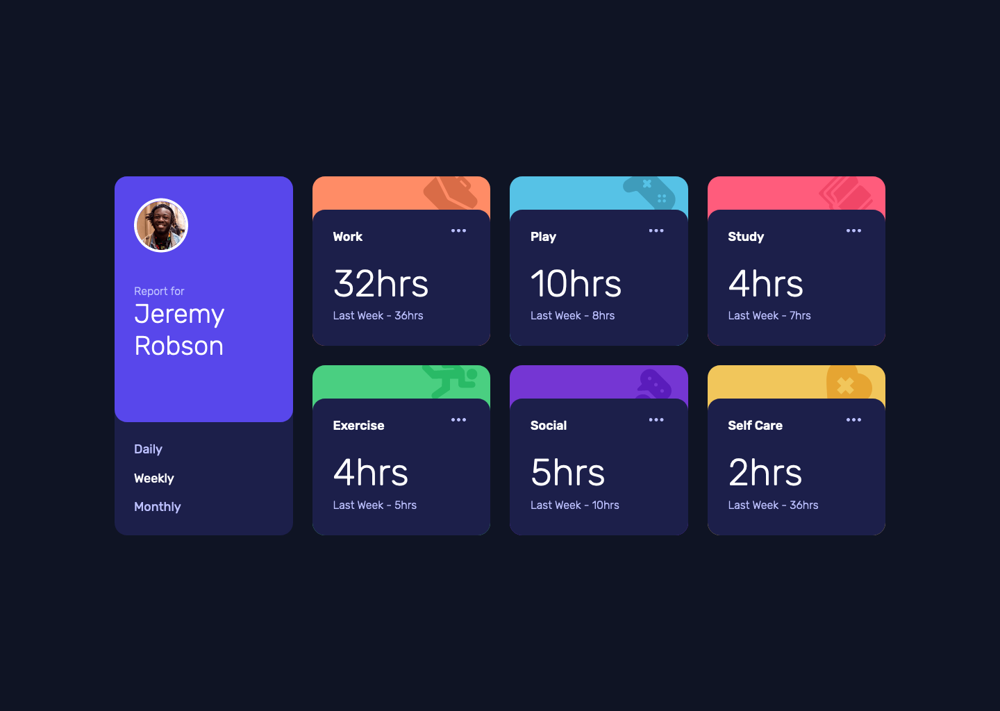

# Frontend Mentor - Time tracking dashboard solution

This is a solution to the [Time tracking dashboard challenge on Frontend Mentor](https://www.frontendmentor.io/challenges/time-tracking-dashboard-UIQ7167Jw). Frontend Mentor challenges help you improve your coding skills by building realistic projects. 

## Table of contents

- [Overview](#overview)
  - [The challenge](#the-challenge)
  - [Screenshot](#screenshot)
  - [Links](#links)
- [My process](#my-process)
  - [Built with](#built-with)
  - [What I learned](#what-i-learned)
  - [Continued development](#continued-development)
  - [Useful resources](#useful-resources)
- [Author](#author)

## Overview

### The challenge

Users should be able to:

- View the optimal layout for the site depending on their device's screen size
- See hover states for all interactive elements on the page
- Switch between viewing Daily, Weekly, and Monthly stats

### Screenshot

### Links

- Solution URL: [Solution Repo](https://github.com/its-me-musa/time-tracking-dashboard)
- Live Site URL: [Live Site](https://nervous-ride-ebeeb6.netlify.app)

## My process

### Built with

- Semantic HTML5 markup
- CSS custom properties
- Flexbox
- CSS Grid
- JavaScrip

### What I learned
Fetch data and use it to display on the site

### Continued development
Probably a better, more elegant, fast way of implementing of getting the data and displaying it

### Useful resources

- [Stack Overflow](https://stackoverflow.com) - This helped me a lot.
- [MDN](https://developer.mozilla.org/en-US/) - Arguably one of the best resourcs out there

## Author

- GitHub - [Musa](https://github.com/its-me-musa)
- Frontend Mentor - [@its-me-musa](https://www.frontendmentor.io/profile/its-me-musa)
